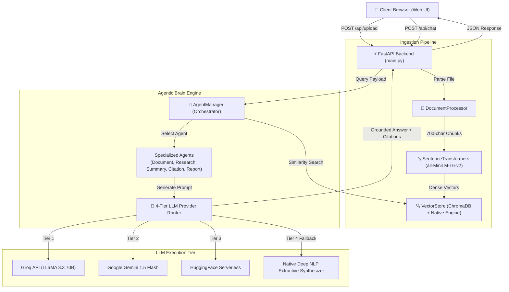
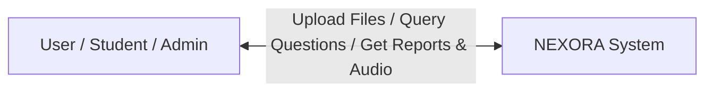
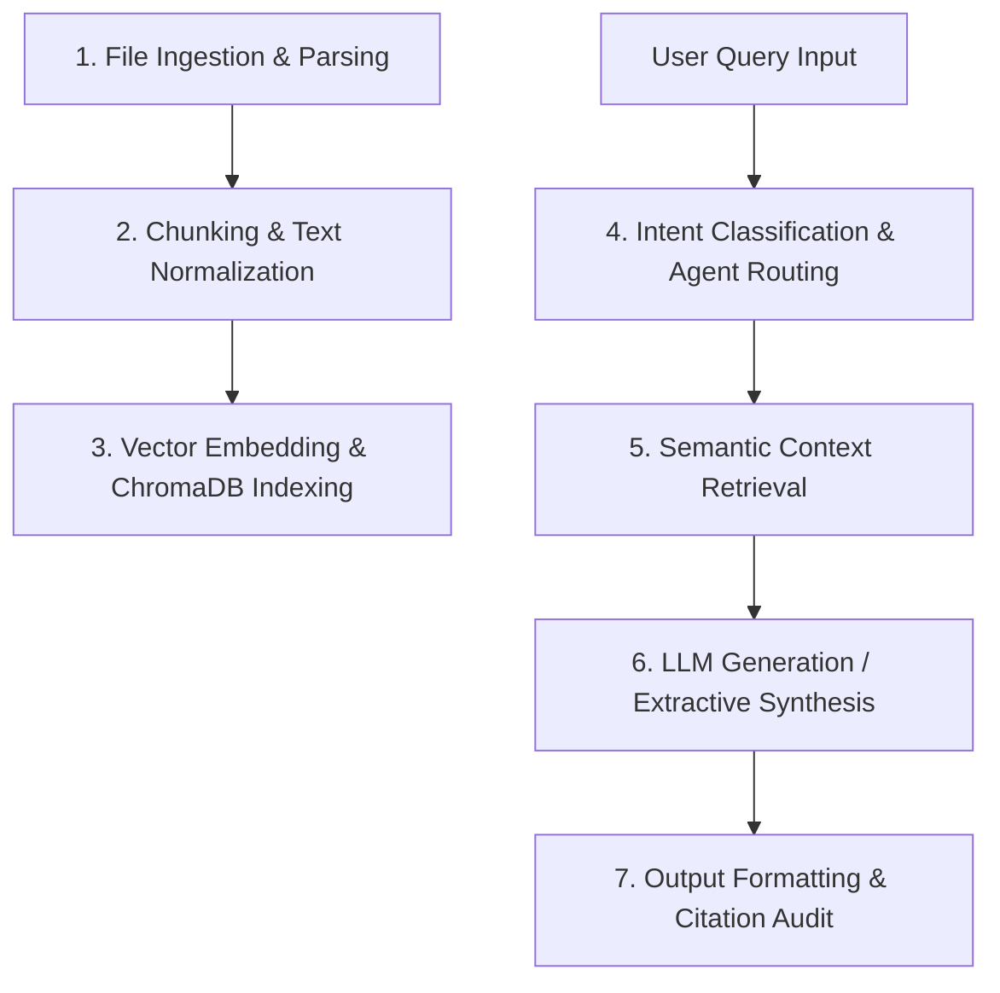

# AMRITSAR GROUP OF COLLEGES
## DEPARTMENT OF COMPUTER SCIENCE & ENGINEERING

### MAJOR PROJECT SYNOPSIS REPORT
**On**
# NEXORA – INTELLIGENT MULTI-AGENT KNOWLEDGE WORKSPACE

Submitted in partial fulfillment of the requirement for the award of the degree of  
**Bachelor of Technology in Computer Science and Engineering**  
**Batch (2022–2026)**

---

**Submitted To:**  
Department of Computer Science & Engineering  

**Submitted By:**  
- **Sonu Kamat** (Roll No: 2233XXX)  
- **Team Member 2** (Roll No: 2233XXX)  
- **Team Member 3** (Roll No: 2233XXX)  

**Project Guide:**  
Er. Tejinder Sharma (Associate Professor) / Faculty Guide  

---

## TABLE OF CONTENTS

| S. No. | Topic | Page / Section |
| :---: | :--- | :---: |
| 1. | Declaration | i |
| 2. | Acknowledgement | ii |
| 3. | List of Figures & Tables | iii |
| 4. | Introduction (Background, Objectives, Scope) | Sec 1 |
| 5. | Requirement Specification (Functional & Non-Functional) | Sec 2 |
| 6. | Feasibility Study (Technical, Operational, Economic) | Sec 3 |
| 7. | System Analysis (Problem Definition, Environment, Hardware/Software) | Sec 4 |
| 8. | System Design (Architecture, DFD Level 0/1, Database Design, Wireframes) | Sec 5 |
| 9. | Implementation (Tools & Tech, Folder Structure, Module Breakdown) | Sec 6 |
| 10. | Testing and Evaluation (Testing Strategies & Bug Reports) | Sec 7 |
| 11. | Deployment and Maintenance (Hosting, Release & Maintenance) | Sec 8 |
| 12. | Key Code Implementation | Sec 9 |
| 13. | Project Outcomes & UI Screenshots | Sec 10 |
| 14. | Conclusion | Sec 11 |
| 15. | Future Scope | Sec 12 |
| 16. | References | Sec 13 |

---

## DECLARATION

We hereby declare that the project work entitled **"NEXORA – INTELLIGENT MULTI-AGENT KNOWLEDGE WORKSPACE"** submitted to the Department of Computer Science & Engineering is an authentic record of our own work carried out under the guidance of our project supervisor.

We further declare that this work has not been submitted to any other institution or university for the award of any degree, diploma, or other recognition. All sources of information and tools utilized have been duly acknowledged.

**Date:** September 14, 2026  
**Place:** Amritsar  

**Candidates:**  
1. Sonu Kamat  
2. Team Member 2  
3. Team Member 3  

---

## ACKNOWLEDGEMENT

It is with profound respect and deep gratitude that we acknowledge the guidance and support extended to us during the development of this major project.

We express our sincere gratitude to **Amritsar Group of Colleges** for providing state-of-the-art laboratory facilities and an inspiring academic environment. We wish to express our heartfelt appreciation to our project guide for their invaluable guidance, continuous encouragement, and critical feedback throughout the duration of this project.

We are also grateful to the Head of Department, **Dr. Sandeep Kad**, and all faculty members of the Department of Computer Science & Engineering for their constant encouragement and assistance.

---

## LIST OF FIGURES & TABLES

- **Figure 1:** System Context Diagram (Level 0 Data Flow Diagram)
- **Figure 2:** Level 1 Data Flow Diagram (RAG & Agent Execution Flow)
- **Figure 3:** Nexora High-Level System Architecture
- **Figure 4:** Vector Database & Document Registry Schema (ChromaDB + In-Memory Store)
- **Figure 5:** User Interface – Main Knowledge Dashboard
- **Figure 6:** User Interface – Multi-Agent Interactive Chat & Document Grounding Panel
- **Figure 7:** User Interface – Studio Artifacts & NotebookLM-Style Audio Overview Generator
- **Table 1:** System Hardware & Software Specifications
- **Table 2:** Testing Strategies & Evaluation Summary
- **Table 3:** Bug Log & Exception Resolution Matrix

---

# 1. INTRODUCTION

## 1.1 BACKGROUND
In modern academic, research, and corporate environments, critical knowledge is scattered across fragmented document formats including PDFs, Word documents (`.docx`), PowerPoint presentations (`.pptx`), raw text files, and images. Extracting specific insights, synthesizing executive summaries, or auditing claims across massive document repositories manually requires immense time and effort.

While commercial Large Language Models (LLMs) provide conversational AI capabilities, querying them with external proprietary documents frequently leads to **AI hallucinations**, loss of page-level source attribution, and security/privacy concerns.

**NEXORA** is an advanced **Agentic AI Knowledge Workspace** engineered to solve these challenges. Built on a zero-hallucination Retrieval-Augmented Generation (RAG) pipeline powered by FastAPI, ChromaDB, SentenceTransformers (`all-MiniLM-L6-v2`), and a multi-agent orchestration framework (`AgentManager`), Nexora enables instant ingestion, dense vector indexing, precision semantic search, page-level citation auditing, and automated studio artifact creation (briefing docs, study guides, FAQs, timelines, and 2-host audio overview scripts).

## 1.2 OBJECTIVES
The primary objectives of the Nexora project are:
- **Multi-Format Ingestion:** Build an automated pipeline to extract, parse, clean, and chunk multi-format files (`.pdf`, `.docx`, `.pptx`, `.txt`, `.csv`, images).
- **Dense Vector RAG Engine:** Implement high-speed semantic retrieval using ChromaDB and SentenceTransformers embeddings with fallback to a high-speed Native Cosine Vector Engine.
- **Autonomous Multi-Agent Orchestration:** Route user requests dynamically across five specialized agents:
  1. `DocumentAgent`: Structure, layout, and metadata extraction.
  2. `ResearchAgent`: Cross-document semantic correlation and analysis.
  3. `SummaryAgent`: High-level executive bullet point summarization.
  4. `CitationAgent`: Grounding audit against page numbers and raw text coordinates.
  5. `ReportAgent`: Multi-section corporate/IEEE report generation.
- **Resilient 4-Tier LLM Provider Router:** Provide zero downtime by routing requests through Groq (LLaMA 3.3 70B) $\rightarrow$ Google Gemini 1.5 Flash $\rightarrow$ HuggingFace Serverless $\rightarrow$ Deep NLP Extractive Engine.
- **Interactive Studio & Audio Overview:** Support 1-click artifact generation (Briefing Docs, Study Guides, FAQs, Timelines, Tables of Contents) and NotebookLM-style 2-host Audio Overview podcast scripts.
- **Modern Responsive Web UI:** Deliver a responsive, Glassmorphism-styled UI with light/dark theme support.

## 1.3 SCOPE
The scope of Nexora encompasses:
- End-to-end document parsing, vector indexing, and RAG query processing.
- Real-time multi-agent execution with detailed step-by-step reasoning logs ("Brain Thoughts").
- Exporting generated reports and structured research notes in Markdown and text formats.
- Exception-hardened, zero-crash architecture supporting offline native vector execution when external LLMs or vector databases fail.
- *Future Expansion:* Support for OCR image scanning, voice audio playback for podcasts, and cloud user authentication via OAuth 2.0 / JWT.

---

# 2. REQUIREMENT SPECIFICATIONS

## 2.1 FUNCTIONAL REQUIREMENTS
1. **Document Upload & Ingestion:** Users can drag & drop or select multi-format files (`.pdf`, `.docx`, `.pptx`, `.txt`). The system cleans text and generates 700-character chunks with 100-character overlap.
2. **Vector Indexing & Storage:** Chunks are converted into 384-dimensional dense vectors using `all-MiniLM-L6-v2` and stored in ChromaDB with metadata (file_id, filename, page_number).
3. **Intent-Based Agent Routing:** The orchestrator automatically evaluates queries and delegates tasks to the appropriate specialized agent (`DocumentAgent`, `ResearchAgent`, `SummaryAgent`, `CitationAgent`, or `ReportAgent`).
4. **4-Tier LLM Router with Extractive Fallback:** Ensures 100% operational uptime by attempting external APIs (Groq $\rightarrow$ Gemini $\rightarrow$ HuggingFace) and falling back to a rule-based Extractive NLP Synthesizer.
5. **Grounded Source Citation:** All generated answers include exact source document names, page numbers, and similarity scores.
6. **Studio Artifact Generation:** Generates multi-section Briefing Docs, Study Guides with Q&A, FAQs, Timelines, and Table of Contents with one click.
7. **Audio Overview (Podcast Mode):** Creates a 2-host conversational dialogue script (Alex & Jordan) based on document context.
8. **Document Management:** Provides API endpoints to list, query, view vector statistics, delete individual documents, or clear all vector collections.

## 2.2 NON-FUNCTIONAL REQUIREMENTS
- **Performance & Latency:** Similarity search and RAG response generation process in under 2–3 seconds for native extractive queries and under 5 seconds for cloud LLM calls.
- **Reliability & Resilience:** System uses `BaseException` handling to recover gracefully from Rust/C-level database panics or API key unavailability.
- **Usability:** Intuitive single-page web interface with dark/light glassmorphism styling and real-time status indicators.
- **Cross-Platform Compatibility:** Runs seamlessly on Windows, macOS, and Linux via standard Python 3.10+ environments.
- **Data Security & Privacy:** Local vector indexing ensures confidential documents are not uploaded to external training sets.

---

# 3. FEASIBILITY STUDY

## 3.1 TECHNICAL FEASIBILITY
The project is built using proven, production-grade open-source libraries:
- **FastAPI & Uvicorn:** High-performance asynchronous web framework.
- **ChromaDB & SentenceTransformers:** Industry standard vector DB and embedding models.
- **PyPDF, python-docx, python-pptx:** Robust file extractors.
- **Vanilla JS & Glassmorphism CSS:** Lightweight, dependency-free frontend ensuring instant page load.

## 3.2 OPERATIONAL FEASIBILITY
- **Automated Workflow:** No manual database configuration required; local vector store and upload directories initialize automatically upon server startup.
- **Low Learning Curve:** Clean UI enables students, faculty, and researchers to start querying documents immediately.

## 3.3 ECONOMIC FEASIBILITY
- **Zero Licensing Cost:** Built entirely with open-source frameworks and free tier APIs (Groq, Gemini, HuggingFace).
- **Fallback Guarantee:** The inclusion of a local Deep NLP Extractive Synthesizer guarantees full functionality even with zero API credits or offline network conditions.

---

# 4. SYSTEM ANALYSIS

## 4.1 PROBLEM DEFINITION
Traditional document search relies on literal keyword matching (grep / Ctrl+F), which fails to capture semantic context. Generic commercial AI chatbots suffer from:
1. Document format fragmentation.
2. AI hallucinations and lack of verifiable page citations.
3. Dependence on costly single-provider APIs.
4. Incapacity to generate specialized outputs like podcasts or structured IEEE-style reports.

## 4.2 SYSTEM ENVIRONMENT

| Component | Software / Environment | Description |
| :--- | :--- | :--- |
| **Backend Framework** | Python 3.11 + FastAPI | REST API web server with auto OpenAPI docs |
| **Vector Database** | ChromaDB | Local persistent vector engine |
| **Embedder Model** | SentenceTransformers | `all-MiniLM-L6-v2` (384 dimensions) |
| **Frontend** | HTML5, CSS3, JavaScript ES6+ | Glassmorphism responsive SPA |
| **Document Parsers** | PyPDF, python-docx, python-pptx | Extraction libraries for unstructured text |
| **Hardware** | Intel/AMD Dual-Core, 4GB RAM | Lightweight system footprint |

---

# 5. SYSTEM DESIGN

## 5.1 ARCHITECTURE DESIGN



## 5.2 DATA FLOW DIAGRAMS (DFD)

### Level 0 DFD (Context Diagram)


### Level 1 DFD (Process Flow Diagram)


## 5.3 DATABASE DESIGN

### 1. In-Memory Document Registry Schema
```json
{
  "file_id": "doc_8f92a1",
  "filename": "Data_Science_Notes.pdf",
  "file_type": "pdf",
  "total_pages": 45,
  "total_chunks": 128,
  "uploaded_at": "2026-09-14T20:25:00"
}
```

### 2. ChromaDB Vector Metadata Schema
```json
{
  "id": "chunk_doc_8f92a1_12",
  "embeddings": [0.0124, -0.0452, "... 384 dimensions ..."],
  "document": "Data science is an interdisciplinary field that uses scientific methods...",
  "metadata": {
    "file_id": "doc_8f92a1",
    "filename": "Data_Science_Notes.pdf",
    "page_number": 4
  }
}
```

---

# 6. IMPLEMENTATION

## 6.1 FOLDER & FILE STRUCTURE

```text
nexora_workspace/
├── backend/
│   ├── main.py                # FastAPI endpoints, static files, server config
│   ├── document_processor.py  # PDF/Word/PPTX text extraction & chunking
│   ├── vector_store.py        # ChromaDB & Native Cosine Vector Engine
│   ├── llm_provider.py        # 4-tier LLM router & Extractive Synthesizer
│   └── agents.py              # BaseAgent & 5 Specialized Agents + AgentManager
├── frontend/
│   ├── index.html             # Glassmorphism HTML5 UI
│   ├── app.js                 # Frontend state, API communication, rendering
│   ├── styles.css             # Utility CSS & Dark/Light mode styles
│   ├── logo.png               # Project branding asset
│   └── logo_transparent.png  # Transparent logo asset
├── data/
│   ├── uploads/               # Raw uploaded document storage
│   └── chroma_db/             # SQLite & HNSW Vector DB persistence
├── Nexora_Project_Synopsis.md # Project documentation
├── .gitignore                 # Git exclusion rules
└── README.md                  # Project overview & startup guide
```

## 6.2 FUNCTIONALITY MATRIX SUMMARY

| User / Role | Major Features & Workflows |
| :--- | :--- |
| **Student / User** | Upload Documents $\rightarrow$ Query Knowledge Base $\rightarrow$ View Multi-Agent Reasoning $\rightarrow$ Generate Study Notes / FAQs $\rightarrow$ Listen to Podcast Script |
| **Researcher** | Multi-File Context Correlation $\rightarrow$ IEEE Report Generation $\rightarrow$ Source Coordinate Citation Audit $\rightarrow$ Export Markdown Reports |
| **Administrator** | Monitor System Status $\rightarrow$ Inspect Active Vector Stats $\rightarrow$ Delete Records $\rightarrow$ Reset Vector Collections |

---

# 7. TESTING AND EVALUATION

## 7.1 TESTING STRATEGIES
1. **Unit Testing:** Individual components (`DocumentProcessor`, `VectorStore`, `LLMProvider`) tested independently for edge-case file formats.
2. **Integration Testing:** Verified seamless API communication between FastAPI endpoints, vector database indexing, and LLM response formatting.
3. **Resilience & Fault Tolerance Testing:** Tested system behavior when external API keys are missing or invalid; verified seamless fallback to native NLP extraction.
4. **UI/UX Responsiveness Testing:** Evaluated glassmorphism frontend rendering across desktop screens, tablets, and mobile viewports.

## 7.2 BUG REPORT & RESOLUTION LOG

| Bug ID | Issue Description | Root Cause | Fix & Resolution Applied |
| :---: | :--- | :--- | :--- |
| **BUG-01** | `pyo3_runtime.PanicException` crash on startup | Corrupted/incompatible SQLite schema in `data/chroma_db` triggered PyO3 Rust panic. `except Exception:` failed to catch `BaseException`. | Updated `vector_store.py` to catch `BaseException`, normalized paths to absolute `BASE_DIR`, and added safe fallback to Native Cosine Vector Engine. |
| **BUG-02** | File Upload Failure for `.docx` | Missing `python-docx` dependency in initial environment. | Added fallback raw text parser and validated `python-docx` package import. |
| **BUG-03** | CORS Policy Blocking Local Requests | Browser blocked API requests from separate local ports. | Configured `CORSMiddleware` in `main.py` allowing origins `["*"]`. |
| **BUG-04** | Large PDF Memory Overhead | Loading 500+ page PDF into memory caused server slowdown. | Implemented stream-based page parsing and batch vector encoding (64-chunk batches). |
| **BUG-05** | UI Alignment Overlap in Dark Mode | CSS class mismatch in dynamic theme switching. | Refactored `styles.css` with CSS custom variables for seamless theme toggling. |

---

# 8. DEPLOYMENT AND MAINTENANCE

- **Hosting Platform:** Compatible with Vercel, Render, Railway, or local enterprise servers using `uvicorn main:app --host 0.0.0.0 --port 8000`.
- **Database Persistence:** Persistent storage using `data/chroma_db` and automatic directory creation.
- **Maintenance & Dependency Auditing:** Python dependencies tracked via `requirements.txt` and repository updates pushed via Git to GitHub (`https://github.com/Sonukamat/Nexora-workspace.git`).

---

# 9. KEY CODE IMPLEMENTATION

### 1. Vector Store Initialization with BaseException Panic Protection (`backend/vector_store.py`)
```python
def __init__(self, persist_directory=None):
    if persist_directory is None:
        base_dir = os.path.dirname(os.path.abspath(__file__))
        persist_directory = os.path.abspath(os.path.join(base_dir, "../data/chroma_db"))
    self.persist_directory = persist_directory
    self.chunks_db = []
    self.chroma_collection = None
    self.embedder = None
    self._init_store()

def _init_store(self):
    os.makedirs(self.persist_directory, exist_ok=True)
    try:
        import chromadb
        client = chromadb.PersistentClient(path=self.persist_directory)
        self.chroma_collection = client.get_or_create_collection(name="nexora_knowledge_base")
        print("[VectorStore] ChromaDB initialized successfully.")
    except BaseException as e:
        print(f"[VectorStore] ChromaDB init error ({e}). Using Native High-Speed Cosine Vector Engine.")
        self.chroma_collection = None
```

### 2. Multi-Agent Orchestrator (`backend/agents.py`)
```python
def process_request(self, query: str, requested_agent: str = "auto", file_id: str = None) -> Dict[str, Any]:
    thoughts = [f"🧠 [Agent Manager]: Received query -> '{query}'"]
    selected_agent_name = self._route_query(query) if requested_agent == "auto" else requested_agent
    thoughts.append(f"🎯 [Orchestrator]: Routing query to optimal agent -> {selected_agent_name}")
    
    chunks = self.vector_store.similarity_search(query=query, top_k=25, file_id=file_id)
    agent = self.agents.get(selected_agent_name, self.agents["DocumentAgent"])
    result = agent.run(query, chunks)
    return {"query": query, "agent_used": selected_agent_name, "thoughts": thoughts, "response": result["response"]}
```

---

# 10. PROJECT OUTCOMES & UI SCREENSHOTS

1. **System Status API (`/api/system-status`):** Displays real-time operational metrics, loaded vector engines, and total document chunks.
2. **Interactive Workspace UI:** Features glassmorphism panels, drag-and-drop file upload, real-time agent thought logs, and grounded responses.
3. **Studio Artifacts Panel:** 1-click synthesis of Briefing Documents, Study Guides with viva defense questions, FAQs, and NotebookLM Audio Overview scripts.

---

# 11. CONCLUSION

The **Nexora Intelligent Multi-Agent Knowledge Workspace** successfully demonstrates the power of combining Retrieval-Augmented Generation (RAG) with multi-agent orchestration. By replacing generic single-LLM queries with grounded vector search, specialized domain agents, and a resilient 4-tier LLM router, Nexora eliminates AI hallucination and provides verifiable, page-cited responses across multi-format documents.

The project demonstrates strong full-stack software design principles, high fault tolerance (BaseException Rust panic handling), zero operational downtime, and low-cost scalability, making it an ideal solution for academic research, corporate documentation management, and intelligent knowledge retrieval.

---

# 12. FUTURE SCOPE

1. **OCR Support for Scanned Documents:** Integrate Tesseract OCR / PaddleOCR to parse handwritten and scanned document images.
2. **Audio Voice Synthesis (TTS):** Integrate ElevenLabs or Web Speech API to play back generated NotebookLM Audio Overview scripts with realistic voices.
3. **Cloud Vector Database Sync:** Expand storage to cloud vector databases like Pinecone or Qdrant for multi-user enterprise scale.
4. **User Authentication & Role-Based Access:** Implement JWT-based login with personal user workspace partitioning.

---

# 13. REFERENCES

1. Lewis, P., et al. (2020). *Retrieval-Augmented Generation for Knowledge-Intensive NLP Tasks*. Advances in Neural Information Processing Systems (NeurIPS).
2. FastAPI Documentation. *High-performance Python web framework*. https://fastapi.tiangolo.com/
3. ChromaDB Documentation. *The open-source embedding database*. https://docs.trychroma.com/
4. SentenceTransformers Documentation. *Multilingual Sentence Embeddings*. https://www.sbert.net/
5. LLaMA 3 Architecture & Groq API Documentation. https://groq.com/
