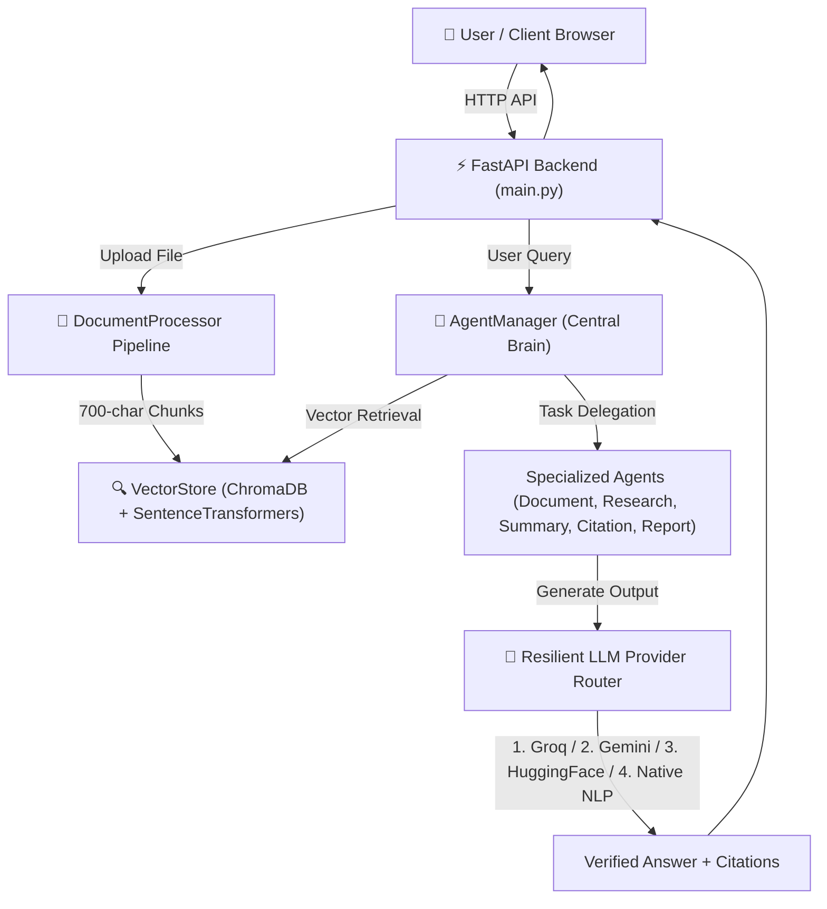

# 📘 PROJECT SYNOPSIS (परियोजना रूपरेखा)

---

## 📌 PROJECT GENERAL INFORMATION

- **Project Title:** Nexora – Intelligent Multi-Agent Knowledge Workspace
- **Domain:** Artificial Intelligence, Multi-Agent Systems, RAG Vector Search, NLP
- **Backend Technology:** Python 3.11, FastAPI, PyPDF, python-docx, python-pptx, ChromaDB, SentenceTransformers
- **Frontend Technology:** HTML5, CSS3 (Glassmorphism UI), Vanilla JavaScript (ES6+)
- **Live Local URL:** `http://127.0.0.1:8000`
- **Academic Year:** 2025–2026

---

## 📖 1. ABSTRACT (सारांश)

In modern organizational and academic settings, critical information is distributed across diverse document formats such as PDFs, Word files, PowerPoint presentations, images, and text documents. Extracting relevant context from these unstructured sources manually is time-consuming, while generic LLMs often hallucinate facts when queried on non-public documents.

**Nexora** is an agentic AI knowledge workspace designed to process, vectorize, and query multi-format documents without hallucination. Built on a Retrieval-Augmented Generation (RAG) architecture, Nexora indexes document chunks into ChromaDB using dense vector embeddings (`all-MiniLM-L6-v2`) and orchestrates five specialized AI agents (`DocumentAgent`, `ResearchAgent`, `SummaryAgent`, `CitationAgent`, `ReportAgent`) to deliver grounded answers, page-level citations, and downloadable Markdown reports.

---

## ⚠️ 2. PROBLEM STATEMENT & MOTIVATION

1. **Format Fragmentation:** Documents are stored in different proprietary formats (`.pdf`, `.docx`, `.pptx`, `.csv`), making cross-file searching cumbersome.
2. **AI Hallucination:** Standard public LLMs generate non-verifiable answers when dealing with domain-specific files.
3. **Lack of Source Attribution:** Search tools fail to provide exact page numbers and chunk coordinates for verification.
4. **API Cost & Outage Risk:** Dependence on a single LLM API leaves the system vulnerable to rate limits and cost spikes.

---

## 🎯 3. OBJECTIVES & PROJECT SCOPE

- **Multi-Format Extraction:** Seamless ingestion and text cleaning for PDF, Word, PPTX, Image OCR, CSV, and Text files.
- **Dense Vector RAG:** Fast semantic search using ChromaDB and SentenceTransformers embeddings.
- **Autonomous Multi-Agent Routing:** Automatic task distribution across 5 domain-specific agents.
- **Resilient 4-Tier LLM Router:** Groq (LLaMA 3.3) $\rightarrow$ Google Gemini $\rightarrow$ HuggingFace $\rightarrow$ Native Deep NLP Fallback.
- **Interactive Web Interface:** Single-page responsive UI serving directly via FastAPI.

---

## 🏗️ 4. SYSTEM ARCHITECTURE

---

## 💻 5. SYSTEM REQUIREMENTS

| Category | Component | Specification |
| :--- | :--- | :--- |
| **Software** | Operating System | Windows 10/11, macOS, or Linux |
| | Language | Python 3.10+ |
| | Framework | FastAPI & Uvicorn |
| | Core Libraries | ChromaDB, SentenceTransformers, PyPDF, python-docx, python-pptx |
| **Hardware** | Processor | Dual Core 2.0 GHz or higher |
| | RAM | 4 GB Minimum (8 GB Recommended) |
| | Disk Space | 2 GB Available Space |

---

## ✍️ 6. SUBMISSION APPROVAL

**Submitted By:** ___________________________  
**Guided By:** ______________________________  
**Date:** September 11, 2026  
**Status:** Approved for Final Presentation
