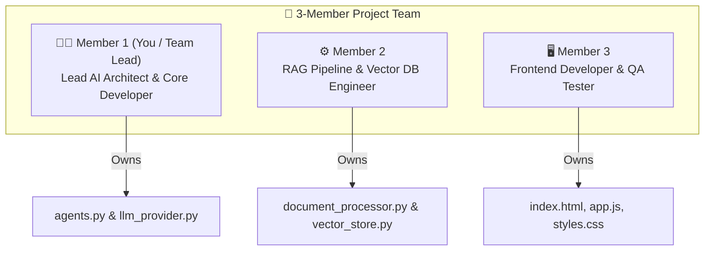

# 👥 TEAM ROLE & WORK DISTRIBUTION PLAN (3 TEAM MEMBERS)

**Project Title:** Nexora – Intelligent Multi-Agent Knowledge Workspace  
**Team Size:** 3 Members  
**Allocation Strategy:** Balanced Module Ownership, Clear Technical Boundaries & Equal Viva Contribution  

---

## 📋 TEAM MEMBER ROLES AT A GLANCE

---

# 👤 MEMBER 1: TEAM LEAD & AI ARCHITECT (आप - लीड डेवलपर)

### 🏷️ Title: Lead AI Systems Architect & Core Developer
### 📂 Modules & Code Owned:
- [`backend/agents.py`](file:///C:/Users/User/.gemini/antigravity/scratch/nexora_workspace/backend/agents.py) (Multi-Agent Swarm Orchestrator & 5 Autonomous Agents)
- [`backend/llm_provider.py`](file:///C:/Users/User/.gemini/antigravity/scratch/nexora_workspace/backend/llm_provider.py) (4-Tier Failover Multi-LLM Router)
- Overall System Integration & Architecture Blueprint

### 🎯 Key Technical Responsibilities:
1. Designed the **Multi-Agent Orchestration Architecture** (`AgentManager`).
2. Implemented the 5 specialized AI agents (`DocumentAgent`, `ResearchAgent`, `SummaryAgent`, `CitationAgent`, `ReportAgent`).
3. Built the 4-Tier failover routing system (Groq $\rightarrow$ Gemini $\rightarrow$ HuggingFace $\rightarrow$ Native Offline NLP).

### 🗣️ Viva & Presentation Topics to Explain:
- High-level system architecture and Multi-Agent Collaboration framework.
- Why Multi-Agent RAG outperforms single-prompt LLMs.
- How the failover router ensures 100% offline uptime.

---

# ⚙️ MEMBER 2: RAG & VECTOR DB ENGINEER (टीम मेंबर 2)

### 🏷️ Title: Data Ingestion & Vector Database Engineer
### 📂 Modules & Code Owned:
- [`backend/document_processor.py`](file:///C:/Users/User/.gemini/antigravity/scratch/nexora_workspace/backend/document_processor.py) (Multi-format text extractor & Semantic Chunker)
- [`backend/vector_store.py`](file:///C:/Users/User/.gemini/antigravity/scratch/nexora_workspace/backend/vector_store.py) (ChromaDB Vector Store & Embedding Manager)

### 🎯 Key Technical Responsibilities:
1. Developed parsers for `.pdf`, `.docx`, `.pptx`, `.csv`, `.png`, and `.txt` files.
2. Implemented the **700-character semantic chunking algorithm** with 100-character overlap.
3. Integrated **ChromaDB Persistent Storage** and configured `SentenceTransformers` (`all-MiniLM-L6-v2`) for 384-dimensional dense vector embeddings.

### 🗣️ Viva & Presentation Topics to Explain:
- Document parsing techniques, regex text cleaning, and page-mapping.
- How dense vector embeddings and Cosine Similarity top-k retrieval work in ChromaDB.
- Semantic chunking strategy and context preservation.

---

# 🖥️ MEMBER 3: FRONTEND DEVELOPER & QA ENGINEER (टीम मेंबर 3)

### 🏷️ Title: Frontend UI/UX Developer & System Testing Lead
### 📂 Modules & Code Owned:
- [`frontend/index.html`](file:///C:/Users/User/.gemini/antigravity/scratch/nexora_workspace/frontend/index.html) (Single-Page Application Structure)
- [`frontend/app.js`](file:///C:/Users/User/.gemini/antigravity/scratch/nexora_workspace/frontend/app.js) (Client-Side Fetch API & Reactive Interaction Engine)
- [`frontend/styles.css`](file:///C:/Users/User/.gemini/antigravity/scratch/nexora_workspace/frontend/styles.css) (Dark Glassmorphism Design System)
- [`backend/main.py`](file:///C:/Users/User/.gemini/antigravity/scratch/nexora_workspace/backend/main.py) (REST Endpoints & Static File Routing)

### 🎯 Key Technical Responsibilities:
1. Designed the dark-themed Glassmorphism Single-Page Dashboard.
2. Implemented client-side asynchronous API fetch calls (`/api/upload`, `/api/chat`, `/api/export-report`).
3. Built page-level citation accordion rendering, live agent progress indicators, and Markdown report exporter.
4. Conducted end-to-end empirical testing and REST API endpoint verification.

### 🗣️ Viva & Presentation Topics to Explain:
- UI design principles, responsive layout, and client-side reactive rendering.
- Async API integration between Vanilla JS and FastAPI backend.
- Live demonstration of document upload, agent chat, and report downloading.

---

## 📑 TEAM MEMBER VIVA QUESTION DISTRIBUTION

| Team Member | Expected Viva Questions to Answer |
| :--- | :--- |
| **Member 1 (Lead)** | What is Multi-Agent RAG? How does `AgentManager` assign queries? How does LLM failover routing work? |
| **Member 2 (RAG)** | What is ChromaDB? Why use `all-MiniLM-L6-v2` embeddings? Why 700-character chunking with 100 overlap? |
| **Member 3 (Frontend/QA)**| How does FastAPI serve static files? How are citations rendered on UI? How does the report export function work? |
